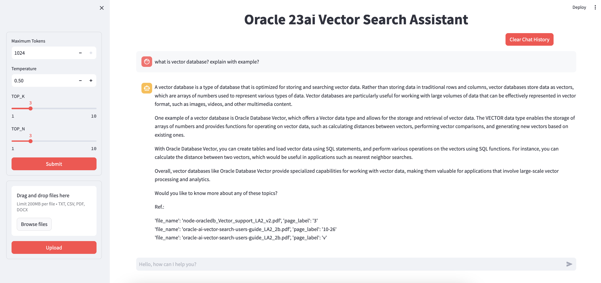

# Integrate Oracle 23ai Vector DB with OCI GenAI using Llama-index (v.0.10+)

## The UI of the **Knowledge Assistant** you can build using following examples.

This repository contains all the work done on the development of RAG applications using:

* [Oracle AI Vector Search](https://www.oracle.com/in/database/ai-vector-search/)
* Oracle OCI [GenAI Service](https://docs.public.oneportal.content.oci.oraclecloud.com/en-us/iaas/Content/generative-ai/home.htm)
* Oracle OCI[ Embeddings](https://docs.public.oneportal.content.oci.oraclecloud.com/en-us/iaas/Content/generative-ai/embed-models.htm)
* Cohere Reranker
* Oracle Accelerated Data Science [ADS](https://accelerated-data-science.readthedocs.io/en/latest/)
* [llama-index](https://docs.llamaindex.ai/en/stable/)

## What is RAG?

A very good introduction to what **Retrieval Augmented Generation** (RAG) is can be found [here](https://www.oracle.com/artificial-intelligence/generative-ai/retrieval-augmented-generation-rag/)

## Setup

* configure conda environment based on requirement.txt
* configure .oci directory with .key& config for [OCI authentication](https://docs.oracle.com/en-us/iaas/Content/API/Concepts/sdkconfig.htm).
* create tables
* update parameter in config.py

## execute chatbot
* streamlit run app.py

## [this work is inspired by Luigi Saetta] (https://github.com/luigisaetta/llamaindex10_oracle)
